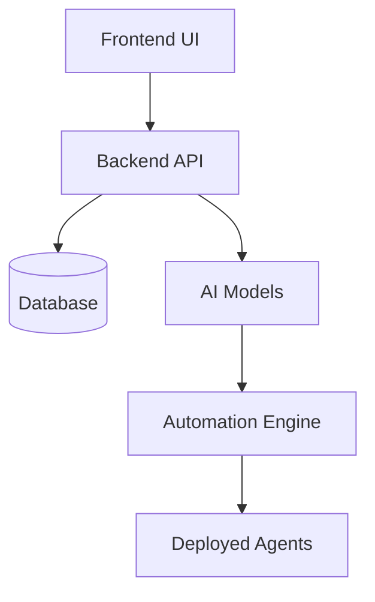

<div align="center">

# ⚡ **Agentium — AI Agents that work, 24/7**


h
<br>
<br>
<br>
<br>
<br>

</div>


<h1>Deploy powerful AI agents that work 24/7.<br>
  From job hunting to e-commerce automation, let intelligent agents handle your repetitive tasks.</h1>
---

## 🌐 **UI Preview**
| Home page | Ai Agent section |
| ----------| -----------------|
| | |
| Features | Pricing |
| | |
| | |


### About

---

## 🧠 **Vision**
> *Not replacing humans, replacing repetitive work.*  
> *Automate the noise. Build the real.*

---

## 🏗️ **Agent Architecture**

<div align="center">



</div>

---

## 🛠️ **Tech Stack**

<div align="center">


</div>

---

---

## 🔢 **Repo Counter & Visitors**

<div align="center">


</div>

---

## 🤝 **Contributors & Support**

<div align="center">


</div>

---

## 🚀 **Deploy on Vercel**

```bash
npm i -g vercel
vercel login
vercel --prod
```

---

## 💬 **Connect with me**

```
👤 Surinder Kumar  
💼 B.Tech CSE • AI & Automation Agent Builder  
📩 DM anytime for collabs, ideas, or building agents together.
```

---

<div align="center">


© 2025 **Agentium**  
*Built with ❤️ for the future. Running today.*

</div>
